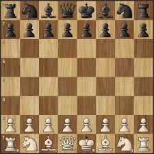

# Chess on Blockchain



A decentralized chess game built on the blockchain that allows players to compete, track their progress, and earn ratings in a transparent and immutable way.

## 🎮 [Live Demo](https://chess-on-blockchain.vercel.app/)

## 🎥 Demo Video ⭐

[](https://www.youtube.com/watch?v=xhVU1DT6rJQ)


## ✨ Features

- **Blockchain Integration**: Game results permanently recorded on the Somnia Testnet
- **ELO Rating System**: Player performance tracked with a blockchain-based rating system
- **AI Opponents**: Play against AI with multiple difficulty levels
- **Comprehensive Game Classification**: Detailed tracking of game outcomes and ending conditions
- **Player Profiles**: View your stats, rating, and performance metrics
- **Game History**: Browse through your past games with detailed information
- **Global Leaderboard**: See how you rank among other players
- **Time Controls**: Different time settings based on difficulty level
- **Responsive Design**: Play on desktop or mobile devices

## 🛠️ Tech Stack

- **Smart Contract**: Solidity 0.8.19
- **Blockchain**: Somnia Testnet
- **Frontend**: React.js
- **Web3 Integration**: ethers.js
- **Chess Logic**: js-chess-engine
- **Styling**: CSS with responsive design
- **Wallet Connection**: MetaMask integration

## 🏆 Game Features

### Game Modes
- **Beginner**: 10 minute time control, level 1 AI
- **Intermediate**: 5 minute time control, level 2 AI
- **Advanced**: 3 minute time control, level 3 AI

### Game Result Types
- Win (1): Player won the game
- Loss (2): Player lost the game
- Draw (3): Game ended in a draw

### Game Ending Types
- Checkmate (1): Game ended by checkmate
- Resignation (2): Game ended by resignation
- Timeout (3): Game ended by timeout/flagging
- Draw Agreement (4): Game ended by mutual draw agreement
- Stalemate (5): Game ended by stalemate
- Insufficient Material (6): Draw due to insufficient material
- Threefold Repetition (7): Draw by threefold repetition
- Fifty-Move Rule (8): Draw by fifty-move rule

## 📋 Project Structure

```
chess-on-chain/
├── contracts/
│   └── ChessGame.sol       # Main smart contract
├── scripts/
│   └── deploy.js           # Deployment script
├── src/
│   ├── components/
│   │   ├── ChessGame.jsx   # Chess game component
│   │   ├── PlayerProfile.jsx # Player stats component
│   │   ├── GameHistory.jsx # Game history component
│   │   ├── Leaderboard.jsx # Global leaderboard component
│   │   └── ChessRules.jsx  # Chess rules component
│   ├── App.jsx             # Main application component
│   └── index.js            # Application entry point
└── public/
    └── index.html          # HTML template
```

## 🚀 Getting Started

### Prerequisites
- Node.js (v14.0.0 or higher)
- npm (v6.0.0 or higher)
- MetaMask extension installed in your browser
- Somnia Testnet tokens (for contract deployment)

### Installation

#### Smart Contract Deployment
1. Clone the repository:
```
git clone https://github.com/Agihtaws/chess-on-blockchain.git
cd chess-on-blockchain
```

2. Install dependencies:
```
npm install
```

3. Create a `.env` file in the root directory with:
```
PRIVATE_KEY=your_wallet_private_key
SOMNIA_TESTNET_URL=https://rpc.ankr.com/somnia_testnet
```

4. Compile and deploy the contract:
```
npx hardhat clean
npx hardhat compile
npx hardhat run scripts/deploy.js --network somnia_testnet
```

5. Note the deployed contract address for frontend configuration.

#### Frontend Setup
1. Navigate to the frontend directory:
```
cd chess-on-chain-frontend
```

2. Install frontend dependencies:
```
npm install
```

3. Update the contract address and ABI in `App.js` with your deployed contract information.

4. Start the development server:
```
npm start
```

5. For production deployment:
```
npm run dev
```

### Getting Somnia Testnet Tokens
If you need testnet tokens to deploy the contract:
- Visit the [Somnia Testnet Faucet](https://testnet.somnia.network/)
- Join the [Somnia Discord](https://discord.com/channels/1209923224620761088/1306988055135256738) for support

## 🎮 How to Play

1. Connect your MetaMask wallet to Somnia Testnet
2. Register as a player (one-time transaction)
3. Select a difficulty level
4. Start a new game
5. Make your moves by selecting and moving pieces
6. Game results are automatically recorded on the blockchain

You can also try the game through the [live demo](https://chess-on-blockchain.vercel.app/) without deploying your own version.

## 🔗 Smart Contract

The chess game smart contract is deployed on the Somnia Testnet at address:
`0x6fc39bFdC9F30028D9EBC4Eaab1d066187f4F35c`

### Key Contract Functions

- `registerPlayer()`: Register a new player
- `recordGameResult()`: Record the outcome of a game
- `getPlayerStats()`: Retrieve a player's statistics
- `getLeaderboard()`: Get the top-ranked players
- `getPlayerGameHistory()`: View a player's past games

## 🎯 Future Enhancements

- Player vs. Player functionality
- Tournament system with prizes
- NFT integration for unique chess pieces
- Cross-chain compatibility
- Advanced ELO rating system based on opponent skill
- Mobile app version

## 📄 License

This project is licensed under the Apache License - see the LICENSE file for details.

## 👥 Contributors

- Swathiga Agihtaws - Developer

## 🙏 Acknowledgements

- [js-chess-engine](https://github.com/josefjadrny/js-chess-engine) for chess logic
- [ethers.js](https://docs.ethers.io/) for blockchain interaction
- [Somnia Testnet](https://somnianetwork.com) for hosting the smart contract
